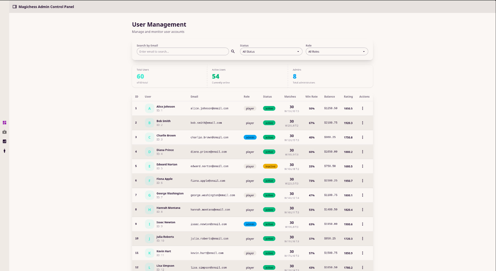

# MagicChess - Data-Intensive Chess Game Application




## Abstract

MagicChess is a full-stack chess game application designed to demonstrate data-intensive system architecture principles. The project implements a distributed database architecture with PostgreSQL replication and sharding to handle high-volume data operations efficiently. The application features a chess game platform where players can compete in matches, manage their profiles, purchase items from shops, and track their performance metrics.

The system architecture includes a primary database for write operations, a read-only replica database for load distribution, and a sharded database for horizontal scaling. The backend API is built with Express.js and TypeScript, providing RESTful endpoints for user management, match tracking, shop operations, and analytics. The frontend is a modern React application with Material-UI components, offering an intuitive interface for players to interact with the game system.

This project showcases advanced database management techniques including streaming replication, database sharding strategies, transaction management across multiple databases, and comprehensive API documentation with Swagger.

## Technologies

- Node.js - 24.10.1
- TypeScript - 5.9.3
- Express - 5.1.0
- PostgreSQL - 16
- React - 19.2.0
- React DOM - 19.2.0
- Vite - 7.2.2
- Docker - Latest
- Docker Compose - Latest
- pg (PostgreSQL client) - 8.16.3
- Zod - 4.1.12
- Swagger UI Express - 5.0.1
- Swagger JSDoc - 6.2.8
- CORS - 2.8.5
- @tanstack/react-router - 1.136.3
- @tanstack/react-query - 5.90.9
- Material-UI - 7.3.5
- Tailwind CSS - 4.1.17
- DaisyUI - 5.5.3

## Project Structure

```
.
├── backend/                 # Express.js API server
│   ├── src/
│   │   ├── controllers/    # Request handlers
│   │   ├── routes/         # API route definitions
│   │   ├── services/       # Business logic and database operations
│   │   ├── schemas/        # Zod validation schemas
│   │   ├── utils/          # Utility functions and middleware
│   │   └── app.ts          # Express application setup
│   ├── Dockerfile
│   └── package.json
├── frontend/               # React application
│   ├── src/
│   │   ├── component/      # React components
│   │   ├── routes/         # Route definitions
│   │   ├── api/            # API client
│   │   ├── hooks/          # Custom React hooks
│   │   └── App.tsx         # Main application component
│   ├── Dockerfile
│   └── package.json
├── db/                     # Database configuration and setup
│   ├── init/               # SQL initialization scripts
│   ├── Dockerfile.replica  # Replica database Dockerfile
│   ├── setup-replica.sh    # Replica setup script
│   └── README.md           # Database documentation
├── compose.yaml            # Docker Compose configuration
└── README.md               # This file
```

## Features

- **User Management**: Player accounts with ratings, match statistics, and currency balances
- **Match System**: Chess game matches with move tracking, results, and rating changes
- **Shop System**: Purchasable chess items organized by categories
- **Transaction Management**: Purchase transactions with currency handling
- **Analytics**: Performance metrics and statistics
- **Database Replication**: Primary-replica setup for read scaling
- **Database Sharding**: Horizontal partitioning for improved performance
- **API Documentation**: Swagger/OpenAPI documentation

## Prerequisites

- Docker
- Docker Compose
- Node.js 24+ (for local development)
- npm or yarn

## Quick Start

1. **Clone the repository**:
   ```bash
   git clone <repository-url>
   cd "Data-intensive System/Final Project"
   ```

2. **Start all services**:
   ```bash
   docker compose up -d
   ```

3. **Access the application**:
   - Frontend: http://localhost:5173
   - Backend API: http://localhost:3000
   - API Documentation: http://localhost:3000/api-docs

## Database Architecture

The project uses a multi-database architecture:

- **Primary Database** (Port 5433): Main database for write operations
- **Replica Database** (Port 5434): Read-only replica for load distribution
- **Shard Database** (Port 5435): Sharded database for horizontal scaling

### Sharding Strategy

Users are distributed across databases using a modulo-based sharding rule:
- User ID % 2 = 0 → Primary Database
- User ID % 2 = 1 → Shard Database

### Replication

The replica database uses PostgreSQL streaming replication to maintain a synchronized copy of the primary database for read operations.

For detailed database setup and configuration, see [db/README.md](./db/README.md).

## API Endpoints

The backend provides RESTful APIs for:

- `/api/users` - User management
- `/api/matches` - Match operations
- `/api/shops` - Shop management
- `/api/items` - Item operations
- `/api/categories` - Category management
- `/api/transactions` - Transaction handling
- `/api/bans` - Ban management
- `/api/metrics` - Analytics and metrics
- `/api/utils` - Utility endpoints

Full API documentation is available at `/api-docs` when the backend is running.

## Development

### Backend Development

```bash
cd backend
npm install
npm run dev
```

### Frontend Development

```bash
cd frontend
npm install
npm run dev
```

## Database Connections

### Primary Database
- Host: localhost
- Port: 5433
- User: postgres
- Password: primary_pass
- Database: postgres

### Replica Database
- Host: localhost
- Port: 5434
- User: postgres
- Password: primary_pass
- Database: postgres

### Shard Database
- Host: localhost
- Port: 5435
- User: postgres
- Password: shard_pass
- Database: postgres

## Stopping Services

```bash
docker compose down
```

To remove volumes (this will delete all data):

```bash
docker compose down -v
```

## Security Notes

⚠️ **Warning**: This setup uses default passwords and is intended for development/testing purposes only. For production:

- Change all default passwords
- Use environment variables or secrets management
- Configure proper authentication
- Enable SSL/TLS connections
- Restrict network access

## License

This project is for educational purposes.

## Author

Long Le - Long.n.le@student.lut.fi

Elena Tishkovskaya - Elena.Tishkovskaya@student.lut.fi

Nghi Pham - Nghi.T.Pham@student.lut.fi